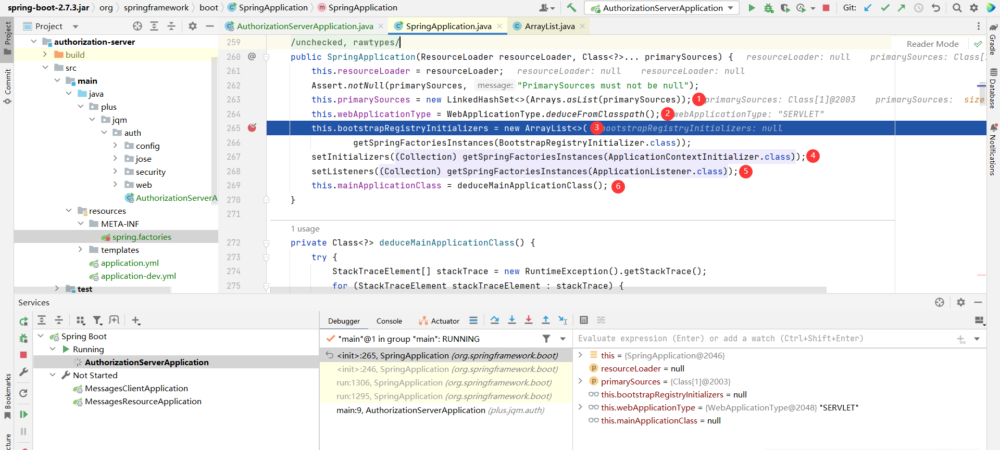
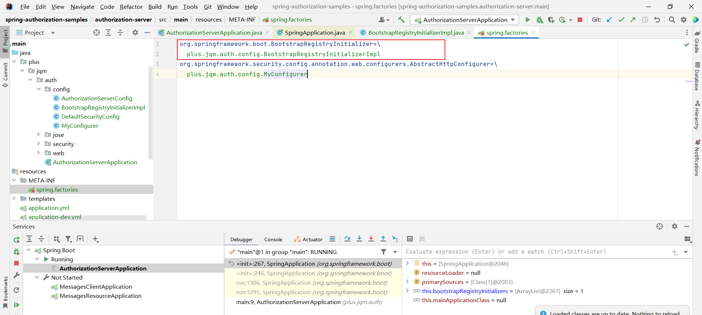
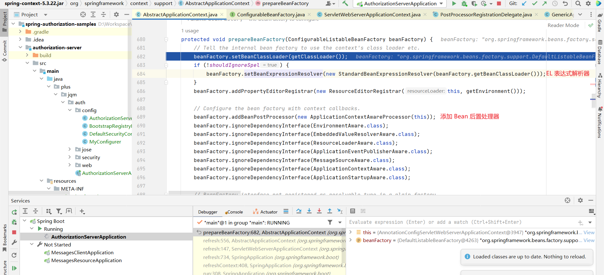
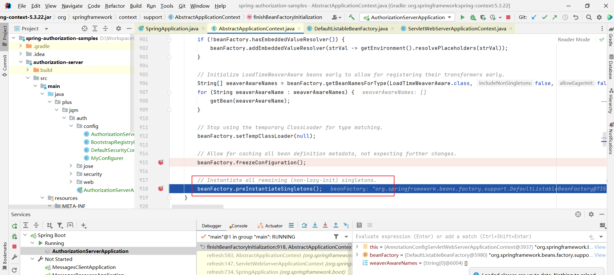
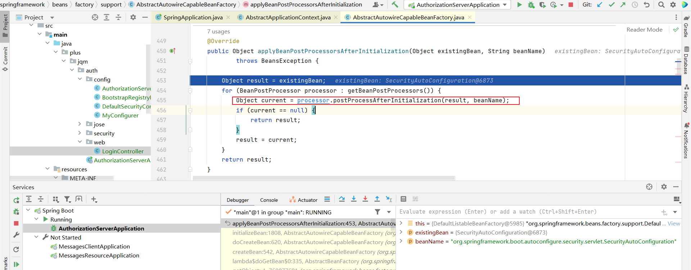

# Spring Boot (5.7.3) 应用初始化流程

## 创建 Spring Application 实例

```java
@SpringBootApplication
public class AuthorizationServerApplication {
    public static void main(String[] args) {
        SpringApplication.run(AuthorizationServerApplication.class, args);
    }
}
```


Spring Boot 应用程序启动。




创建 SpringApplication 实例：

1. 将当前主启动类赋值给 primarySources。在这里指的是 AuthorizationServerApplication.class。

2. 推断 Web 应用程序类型为 Servlet 。

3. 通过 `getSpringFactoriesInstances()` 方法获取类路径下`META-INF/spring.factories` 文件，并从中查找关于 `org.springframework.boot.BootstrapRegistryInitializer` 的配置。
   
   举例说明：
   
   
   
   
   
   

4. 与第三步同样的方式查找关于 `org.springframework.context.ApplicationContextInitializer` 的配置。
   
   举例说明：
   
   

5. 与上述同样的方式查找关于 `org.springframework.context.ApplicationListener` 的配置。
   
   举例说明：
   
   

6. 查找 main 方法。
   
   

## getSpringFactoriesInstances() 方法说明


获取类路径下 `META-INF/spring.factories` 文件，从中加载所有配置类，并缓存到 `cache` 中。下次获取配置类优先从缓存中查找。

## 应用程序启动


### DefaultBootstrapContext

创建 `DefaultBootstrapContext` 实例，并执行所有初始化器的初始化方法。


### SpringApplicationRunListeners

创建 `SpringApplicationRunListeners` 实例，并从类路径下 `META-INF/spring.factories` 文件中获取 `org.springframework.boot.SpringApplicationRunListener` 配置类。


初始化 `SpringApplicationRunListener` 类型配置类，例如：EventPublishingRunListener 。


### DefaultApplicationArguments

封装 main 方法传递进来的参数 `args` 。

### prepareEnvironment

创建 `ApplicationServletEnvironment` 实例和配置环境变量。

### configureIgnoreBeanInfo

配置 `spring.beaninfo.ingore` 环境变量。


### printBanner

打印 Banner。


获取 Banner 文件。


加载图片类型的 Banner。优先从环境变量 `spring.banner.image.location` 属性中指定的路径加载。如果路径为空，则从类路径下加载文件名为 banner 且扩展类型是 `.gif|.jpg|.png`的文件。如果上述都不满足，则返回 null 。


加载文本类型的 Banner。优先从环境变量 `spring.banner.image.location` 属性中指定的路径加载。否则，从类路径下查找文件名为 ` banner.txt` 的文件。如果上述条件都不满足，则返回 null 。


如果图片类型和文本类型的 Banner 都没有找到，则使用 Spring 提供的默认 Banner 。


### createApplicationContext

根据 Web 应用程序类型，创建上下文环境（IOC）。


### prepareContext

上下文环境准备。


### refreshContext

刷新上下文。


#### prepareBeanFactory

Bean 工厂配置。




#### invokeBeanFactoryPostProcessors

调用 Bean 工厂后置处理器。

#### registerBeanPostProcessors

注册 Bean 后置处理器。

#### initMessageSource


#### initApplicationEventMulticaster

初始化 `ApplicationEventMulticaster` 。


#### onRefresh

创建 Web 服务。


#### registerListeners

注册事件监听器。


#### finishBeanFactoryInitialization

创建 Bean 实例。




##### getBean


###### populateBean

属性值填充。


###### initializeBean

初始化 Bean。


applyBeanPostProcessorsBeforeInitialization。


invokeInitMethods。


applyBeanPostProcessorsAfterInitialization。


