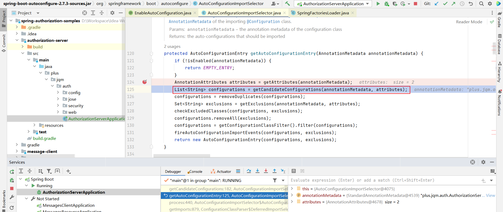

# Spring Boot 自动配置

## @SpringBootApplication

表示一个配置类，它声明一个或多个 `@Bean` 方法，同时触发自动配置和组件扫描。 

这是一个方便的注解，相当于声明了 `@Configuration` 、`@EnableAutoConfiguration` 和 `@ComponentScan` 。

### @SpringBootConfiguration

表示一个类提供 Spring Boot 应用程序的 `@Configuration` 。可以作为 Spring 标准的  `@Configuration` 注解的替代品，这样就可以自动找到配置（例如在测试中）。
应用程序应该只包括一个 `@SpringBootConfiguration` ，大多数习惯性的 Spring Boot 应用程序将从 `@SpringBootApplication` 继承它。

### @EnableAutoConfiguration

启用 Spring Application Context 的自动配置，尝试猜测和配置您可能需要的 bean。自动配置类通常根据您的类路径和您定义的 bean 应用。例如，如果您的类路径中有 tomcat-embedded.jar，您可能需要一个 TomcatServletWebServerFactory（除非您已经定义了自己的 ServletWebServerFactory bean）。
使用 `@SpringBootApplication` 时，上下文的自动配置会自动启用，因此添加此注解不会产生额外影响。
自动配置尝试尽可能智能，并且会随着您定义更多自己的配置而后退。您始终可以手动 exclude() 任何您不想应用的配置（如果您无权访问它们，请使用 excludeName()）。您还可以通过 spring.autoconfigure.exclude 属性排除它们。自动配置总是在用户定义的 bean 注册后应用。
使用 `@EnableAutoConfiguration` 注解的类的包，通常通过 `@SpringBootApplication`，具有特定的意义，通常用作默认。例如，它将在扫描 `@Entity` 类时使用。一般建议您将 `@EnableAutoConfiguration`（如果您不使用 `@SpringBootApplication` ）放在根包中，以便可以搜索所有子包和类。
自动配置类是常规的 Spring `@Configuration` bean。它们使用 `ImportCandidates` 和 `SpringFactoriesLoader` 机制（针对此类）定位。通常自动配置 bean 是 `@Conditional` bean（最常使用 `@ConditionalOnClass` 和 `@ConditionalOnMissingBean` 注释）。

#### @AutoConfigurationPackage

使用 `AutoConfigurationPackages` 注册包。 当没有指定 `basePackages` 或 `basePackageClasses` 时，被注释的类的所在包将被注册。

#### AutoConfigurationImportSelector

`DeferredImportSelector `来处理自动配置。 如果需要对 `@EnableAutoConfiguration` 自定义处理逻辑，您可以实现此接口。

上述为自动配置流程。如果需要 Spring Boot 帮助您自动配置您所需要的 Bean，您可以在类路径下的 `META-INF/spring.factories` 文件中指向您的配置类。
